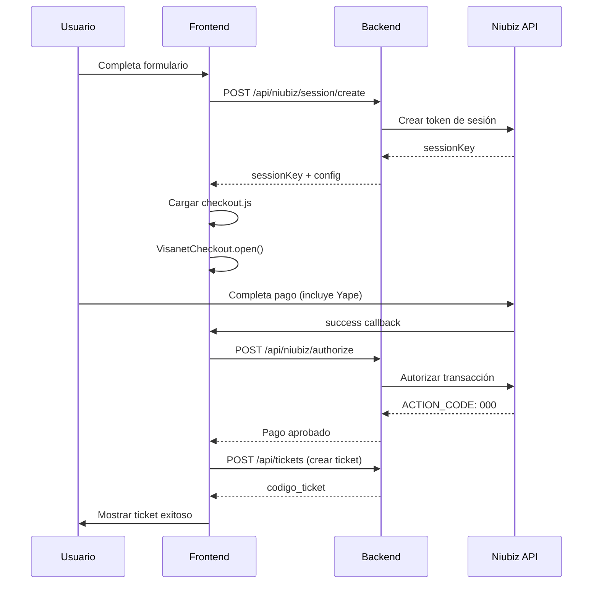

# 🎯 Resumen: Integración Correcta de Niubiz según Documentación Oficial

## 📋 **Problema Identificado**
La implementación anterior intentaba usar una API directa de Yape que **NO EXISTE**. Niubiz maneja Yape a través del **Botón de Pago Web**, no con endpoints específicos de Yape.

## 🔄 **Solución Implementada: Flujo Correcto**

### **1. Backend - Controlador Niubiz** ✅
- **Archivo**: `backend/controllers/niubiz.controller.js`
- **Cambios**: 
  - `createSession()`: Crea token de sesión según documentación oficial
  - `authorizeTransaction()`: Autoriza transacción después del checkout web
  - Mantiene compatibilidad con rutas anteriores

### **2. Backend - Rutas Actualizadas** ✅
- **Archivo**: `backend/routes/niubiz.routes.js`
- **Nuevas rutas**:
  - `POST /api/niubiz/session/create`: Crear sesión de pago
  - `POST /api/niubiz/authorize`: Autorizar transacción
- **Mantiene compatibilidad** con rutas legacy

### **3. Frontend - Componente Actualizado** ✅
- **Archivo**: `frontend/src/components/FormularioRegistro.jsx`
- **Funciones nuevas**:
  - `cargarLibreriaNiubiz()`: Carga dinámicamente la librería de checkout
  - `configurarCheckoutNiubiz()`: Configura el botón según documentación
  - `procearPagoExitoso()`: Maneja el callback de éxito
- **Elimina**: Polling innecesario (ahora usa callbacks directos)

### **4. Frontend - Estilos CSS** ✅
- **Archivo**: `frontend/src/styles/FormularioRegistro.css`
- **Agregado**: Estilos para `.pago-niubiz`, `.niubiz-mock-container`, `.niubiz-processing`
- **Mantiene**: Estilos legacy para compatibilidad

### **5. Página de Prueba** ✅
- **Archivo**: `frontend/public/test-niubiz.html`
- **Propósito**: Demostrar el flujo completo según documentación
- **Incluye**: Logging detallado para debugging

## 🎯 **Flujo Correcto Implementado**

## 🔧 **URLs y Endpoints Correctos**

### **Producción**:
- **Base URL**: `https://apiprod.vnforapps.com`
- **Checkout Script**: `https://static-content.vnforapps.com/v2/js/checkout.js`

### **Sandbox**:
- **Base URL**: `https://apisandbox.vnforappstest.com`
- **Checkout Script**: `https://pocpaymentserve.s3.amazonaws.com/checkout.js`

## 📊 **Datos de la Documentación**

### **Merchant IDs para Yape**:
- `456879852`
- `341198210` 
- `341198214`

### **Credenciales Sandbox**:
- **Usuario**: `integraciones@niubiz.com.pe`
- **Password**: `_7z3@8fF`

## 🧪 **Modo de Prueba**
- **Detecta automáticamente** si las credenciales son de prueba
- **Simula el flujo completo** sin llamadas reales a Niubiz
- **Muestra UI educativa** explicando qué pasaría en producción

## ✅ **Beneficios de esta Implementación**

1. **✅ Cumple documentación oficial**: Usa el flujo exacto de Niubiz
2. **✅ Incluye Yape nativamente**: A través del Botón de Pago Web
3. **✅ Seguridad**: Todo el pago se maneja en el dominio de Niubiz
4. **✅ Compatibilidad**: Mantiene rutas legacy funcionando
5. **✅ Debugging**: Logs detallados para troubleshooting
6. **✅ Responsive**: UI optimizada para móvil y desktop

## 🚀 **Próximos Pasos**

1. **Probar con credenciales reales** de Niubiz
2. **Configurar merchant ID** apropiado para Yape
3. **Testear flujo completo** en ambiente de producción
4. **Validar integración** con el sistema de tickets

## 📝 **Notas Importantes**

- **No más polling**: El estado se maneja por callbacks directos
- **No más QR local**: Niubiz maneja todo en su formulario web
- **Yape incluido**: Automáticamente disponible en el Botón de Pago Web
- **Fallback robusto**: Modo de prueba para desarrollo sin credenciales reales
